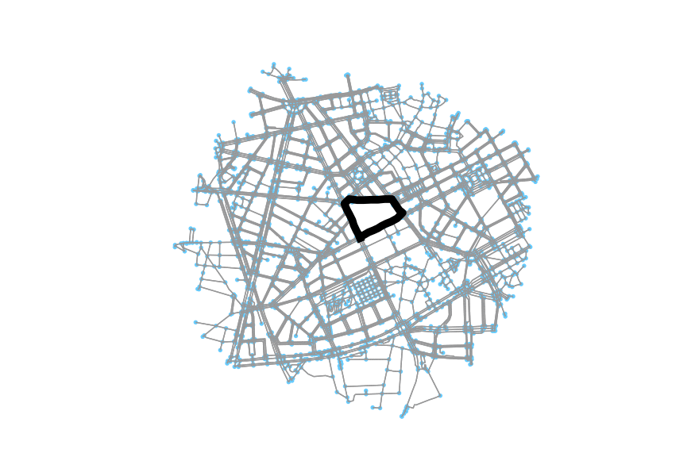

CityRunHeatMap
=====================

#### Work in progress

Planned improvements:
+ different background maps
+ cache maps
+ gcexport integration
+ other fitness apps integration

Description
-----------
Shows an athlete's heat map based on gpx input data. I love running and also discovering cities during my favorite fitness activity. Using the CityRunHeatMap, it is easly possible to explore, how much time I spend running the same tracks and which parts of cities I've never been to.

Based on
-----------
garmin-connect-export of Kyle Krafka
